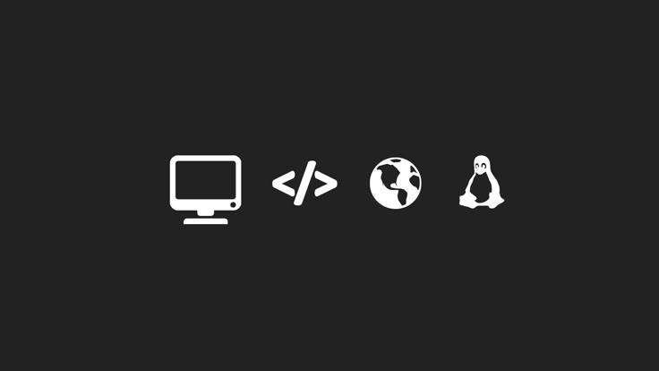

<h1 align="center">Hello  I'm Karamjit Brar</h1>

  

 

## 👨‍💻 About Me

- 💼 **DevOps Engineer — Cloud & Automation Specialist**  
- 📧 br.kramjit@gmail.com | 🌐 [karamjitbrar.com](https://karamjitbrar.com) | 🔗 [LinkedIn](https://linkedin.com/in/karamjitbrar)  
- 🌱 Learning & working on **cloud automation, CI/CD, and hybrid cloud monitoring**  
- 💡 Passionate about automating infrastructure and building scalable cloud solutions  

---

## 🏆 Certifications

---

## 🛠 Technical Skills

### ☁️ Cloud & DevOps

### 💻 Programming & Scripting

### 🖥 Operating Systems

---

## 💼 Work Experience

**System Engineer — Questrade, Toronto, ON** (Dec 2023 – Present)  

**Infrastructure Engineer Intern — Questrade, Toronto, ON** (May 2023 – Dec 2023)  

**DevOps Engineer Intern — CGI Inc., Markham, ON** (Sep 2022 – Apr 2023)  

---

## ❤️ Let's Connect

---

